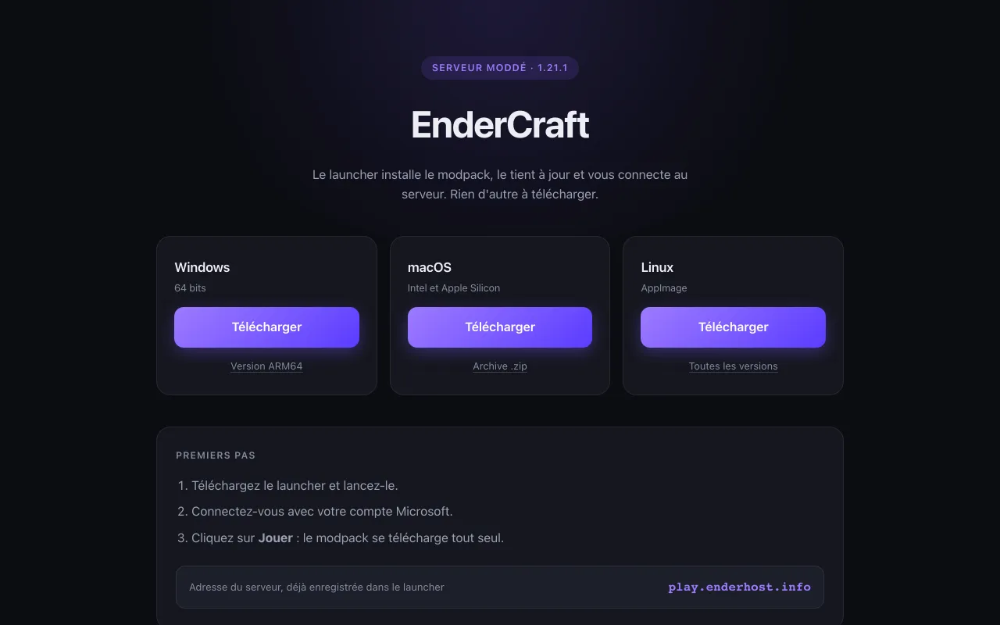
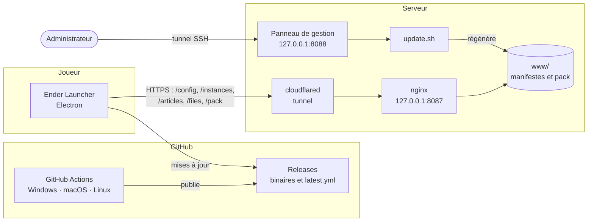

<p align="center"></p>

<h1 align="center">Ender Launcher</h1>

<p align="center">
  Le launcher du serveur Minecraft moddé <strong>EnderCraft</strong> : il installe le modpack, le tient à jour
  et connecte le joueur au serveur.<br>
  Fork de <a href="https://github.com/luuxis/Selvania-Launcher">Selvania Launcher</a>, créé par <strong>Luuxis</strong>.
</p>

<p align="center">
  <a href="https://github.com/minoche95/EnderLauncher/releases/latest"></a>
  <a href="https://github.com/minoche95/EnderLauncher/actions/workflows/build.yml"></a>
  
  
</p>

---

## Télécharger

| Plateforme | Fichier |
|---|---|
| Windows 64 bits | [`Ender-Launcher-win-x64.exe`](https://github.com/minoche95/EnderLauncher/releases/latest/download/Ender-Launcher-win-x64.exe) |
| Windows ARM64 | [`Ender-Launcher-win-arm64.exe`](https://github.com/minoche95/EnderLauncher/releases/latest/download/Ender-Launcher-win-arm64.exe) |
| macOS (Intel et Apple Silicon) | [`Ender-Launcher-mac-universal.dmg`](https://github.com/minoche95/EnderLauncher/releases/latest/download/Ender-Launcher-mac-universal.dmg) |
| Linux | [`Ender-Launcher-linux-x86_64.AppImage`](https://github.com/minoche95/EnderLauncher/releases/latest/download/Ender-Launcher-linux-x86_64.AppImage) |

Les liens pointent toujours vers la dernière version. Une fois installé, le launcher se met à jour tout seul.

**Premiers pas :** lancer le launcher, se connecter avec son compte Microsoft, cliquer sur **Jouer**.
Le modpack se télécharge automatiquement et l'adresse du serveur est déjà enregistrée.

<p align="center">
  
</p>

---

## Fonctionnalités

**Pour le joueur**

- 🔒 Connexion avec un compte Microsoft
- 📦 Installation et mise à jour du modpack : seuls les fichiers modifiés sont retéléchargés (taille puis empreinte SHA-1)
- 🛡️ Fichiers du pack vérifiés à chaque lancement, **sans toucher aux données du joueur** : mondes solo, captures, cartes et réglages sont protégés
- 🟢 Statut réel du serveur et nombre de joueurs connectés
- 📰 Annonces affichées à l'accueil
- ☕ Installation automatique de la bonne version de Java
- 🔄 Mise à jour automatique du launcher, qui ne bloque jamais le jeu en cas de panne réseau
- 💬 Messages d'erreur qui indiquent la vraie cause (serveur d'index arrêté, domaine introuvable…)

**Pour l'administrateur du serveur**

- 🗂️ Un **index HTTP** auto-hébergé qui décrit les instances et sert les fichiers du pack
- 🖥️ Un **panneau de gestion web** : état du service, publication avec aperçu des différences, gestion des fichiers et des annonces, statistiques de lancement
- 🚀 Installation en une commande, rejouable pour se mettre à jour
- 🌐 Une page publique de téléchargement du launcher

---

## Architecture



- **Le launcher ne connaît rien du pack.** Il lit tout depuis l'index : configuration, instances,
  annonces, liste des fichiers avec empreintes, puis les fichiers eux-mêmes.
- **Aucun port ouvert sur le serveur.** nginx n'écoute que sur la boucle locale et c'est un tunnel
  Cloudflare qui publie le service. L'adresse IP d'origine n'est jamais exposée.
- **Le panneau de gestion n'est jamais exposé.** Il n'a pas d'authentification et décide de ce que
  tous les joueurs téléchargent : on l'atteint uniquement par tunnel SSH.
- **Les statistiques viennent du journal d'accès nginx**, pas d'une télémétrie : le launcher
  interroge `/instances` à chaque démarrage, ce qui suffit à compter les lancements.

---

## Côté serveur

Installation de l'index, du panneau et de la page de téléchargement :

```bash
curl -fsSL https://raw.githubusercontent.com/minoche95/EnderLauncher/master/server/install.sh -o install.sh
bash install.sh --url https://index.example.org
```

| Option | Rôle |
|---|---|
| `--url <adresse>` | URL publique de l'index, écrite dans les manifestes |
| `--dir <dossier>` | Dossier d'installation (par défaut `./enderindex`) |
| `--port <port>` | Port d'écoute de nginx (par défaut 8087) |
| `--public` | Écouter sur toutes les interfaces, pour servir sans tunnel |
| `--no-panel` | Installer sans le panneau de gestion |
| `--panel-bind <adresse>` | Rendre le panneau joignable sur le réseau local (jamais sur Internet) |

L'installateur est rejouable : il conserve la configuration et les manifestes existants.

**Publier une mise à jour du modpack :** déposer le contenu du pack dans `pack/EnderCraft/`, puis lancer
`./update.sh` (ou publier depuis le panneau). Rien à redémarrer : le launcher relit le manifeste au
prochain démarrage. `./update.sh --dry-run` montre ce qui serait publié sans rien écrire.

Ce qui ne doit pas partir chez les joueurs — sauvegardes, journaux, caches, fichiers générés — est écarté
par `exclude.txt`, dont les motifs suivent la syntaxe de `.gitignore`.

Documentation complète : [`server/README.md`](../server/README.md).

---

## Ce que ce fork corrige et ajoute

Chaque point ci-dessous a été rencontré en exploitation ou repéré en inspectant le code, puis corrigé et vérifié.

| Symptôme | Cause | Correctif |
|---|---|---|
| Le launcher reste bloqué sur l'image de fond, sans message | Le champ `online` manquait dans `/config` : aucune méthode de connexion ne s'affichait | Champ toujours généré par l'installateur, et documenté comme obligatoire |
| Le serveur est annoncé « en ligne » sans jamais avoir été testé | Texte en dur, et une vérification de statut qui ne répond jamais derrière un proxy dont le serveur est éteint | Statut « Vérification… » par défaut et réponse forcée au bout de 5 secondes |
| Les mondes solo d'un joueur risquaient d'être effacés au lancement | La vérification supprime tout fichier absent du manifeste et de la liste de protection, qui ne comptait que 4 entrées | Liste de protection portée à 18 entrées : mondes, captures, sauvegardes, journaux, cartes et réglages |
| Un accroc réseau vers GitHub fermait le launcher | Un échec de vérification de mise à jour était fatal | Le jeu reste accessible avec la version installée |
| « Aucune connexion internet » alors que c'était le serveur d'index qui était arrêté | Tous les échecs recevaient le même message | Message distinct selon la cause, avec l'adresse interrogée |
| Aucun raccourci après une mise à jour | Les mises à jour silencieuses ne recréent pas les raccourcis | Raccourci bureau recréé à chaque installation, mise à jour comprise, et raccourci ajouté au menu Démarrer |
| L'index ne redémarrait pas après un reboot de la machine | La politique de redémarrage Docker ne recrée pas un conteneur supprimé | Service systemd utilisateur qui relance la pile au démarrage |
| Une release publiée sans binaire Windows, CI au vert | Le script de build n'échouait pas en cas d'erreur | Le build échoue désormais explicitement |

La version 3.2.0 apporte aussi une **refonte graphique complète**, réalisée uniquement en CSS pour ne casser
aucun sélecteur utilisé par le code, avec un contraste de texte d'au moins 4,5:1 dans les deux thèmes.

---

## Développement

Prérequis : Node.js 18 ou plus récent.

```bash
npm install
npm start          # lancer le launcher
npm run dev        # relance automatique à chaque modification, outils de développement ouverts
npm run build      # construire les installateurs de la plateforme courante
```

L'adresse de l'index interrogé est définie par le champ `url` de `package.json`.

Chaque push sur `master` déclenche le workflow **Launcher Build** : il crée la release correspondant à la
version de `package.json`, puis construit et publie les binaires Windows, macOS et Linux. Penser à monter
la version avant de pousser un changement destiné aux joueurs.

---

## Crédits et licence

Ender Launcher est un fork de **[Selvania Launcher](https://github.com/luuxis/Selvania-Launcher)**, créé par
**[Luuxis](https://github.com/luuxis)**. Adaptation pour EnderCraft, index et panneau côté serveur : [Paul Féry](https://github.com/minoche95).

📝 Licence : Luuxis License v1.0 (voir fichier [LICENSE](../LICENSE.md) pour les détails en FR/EN)

**Conditions d'utilisation :**
- Pour utiliser le code vous devez faire un fork du projet.
- Pour utiliser le code votre code doit tout le temps être public.
- Pour utiliser le code toute mention originale de la licence doit être gardé.
- Pour utiliser le code vous devez garder la licence originale.
